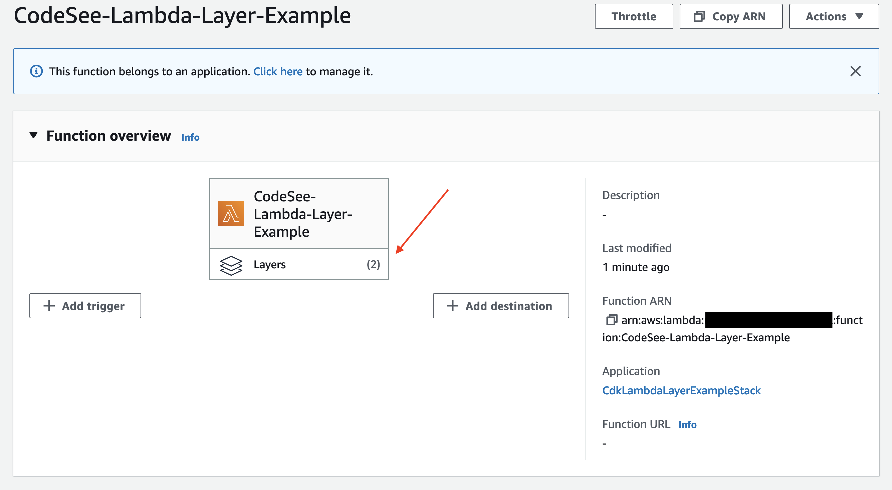

# CodeSee CDK Lambda Layer example

This repo will show you how to use CDK to integrate with CodeSee Lambda Layer
https://docs.codesee.io/docs/lambda-configuration-examples#using-the-dd-bridge-lambda-layer


## Getting Started

```
# go into this example CDK directory
cd cdk-lambda-layer-example

# bootstrap your CDK environment
cdk bootstrap

# deploy the example Lambda with Lambda Layers
cdk deploy
```

## Expected Result

You should see a Lambda created with 2 Layers attached like in the screenshot


